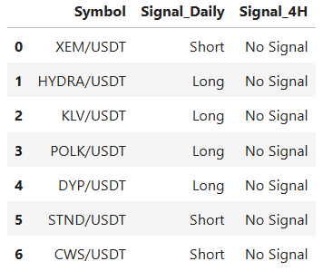

## 📊 Technical Signal Screener Bot
A lightweight crypto signal screener built for manual traders who value speed, clarity, and full control over their decisions.
This is not a trading bot — it’s your personal assistant for market scanning.

## 🚀 Overview
This project helps you identify potential short-term trading opportunities across a wide range of cryptocurrencies.
Instead of automatically executing trades, it monitors market behavior and notifies you about assets that match specific price action patterns — so you can focus on analysis, not searching.

## 🧠 Purpose & Philosophy
Unlike fully automated trading bots (which often make risky decisions in ranging markets), this assistant:

Does not trade for you.

Does not claim to be accurate.

Does not replace human judgment.

Instead, it helps you:

✅ Scan hundreds of crypto assets quickly
✅ Identify potential signals based on price action logic
✅ Get notified instantly via messenger (e.g. Bale)
✅ Decide manually based on volume, trend, and broader technical context

## ⚙️ Signal Logic (Simplified Price Action)
The bot looks for this pattern in both 1D and 4H timeframes:

Long Signal:
Bearish → Bearish → Bullish reversal candle

Short Signal:
Bullish → Bullish → Bearish reversal candle

You will receive alerts only when this pattern is matched.

## 🧱 Features & Architecture
```bash
flowchart TD
    A[Load Markets from Exchange] --> B[Scan Top N Symbols]
    B --> C[Fetch OHLCV (1D, 4H)]
    C --> D[Analyze Price Action Pattern]
    D --> E[Store Valid Results in CSV]
    E --> F[Send Alerts to Messenger]
```
Exchange support: ✅ KuCoin (default), ✅ Binance, ✅ Others via ccxt

Symbol count: customizable (n_symbols = 100 or more)

Fully async, designed for automation

Can be deployed on servers for scheduled loops

## 🔁 Deployment Tips
You can run this bot on a remote server or cloud instance, and set it to:

Loop every N hours (using asyncio or cron)

Scan the full market across multiple exchanges

Deliver reports directly to your phone or desktop

## 🛑 Important Notes
This bot does not make decisions — it's only a signal screener.

Before taking any position, you must analyze:

Volume confirmation

Trend status (avoid sideways/ranging markets)

News or market sentiment

This tool is intended for short-term trades, not long-term holding.

## 🛠️ Tech Stack
Python 3

ccxt for market data

pandas for data handling

asyncio for non-blocking execution

Telegram API (or other messaging tools) for notifications

## 📦 Sample Output
```bash
Symbol	Signal_Daily	Signal_4H
BTC/USDT	Long	Short
ETH/USDT	Short	Short
```

## 🖼️ Screenshots & Preview


## License

This project is licensed under the MIT License.

## 👤 About the Developer
Developed by Erfan Pouretemad as a practical and efficient side project to streamline manual crypto analysis.
For me, trading is personal — I enjoy the decision-making process.
This bot was built to reduce noise, not remove me from the equation.

## 🤝 Let's Connect
I'm always up for collaboration or feedback!

LinkedIn: https://www.linkedin.com/in/erfan-pouretemad/

GitHub: https://github.com/Eptelligence

Website: www.Eptelligence.com
